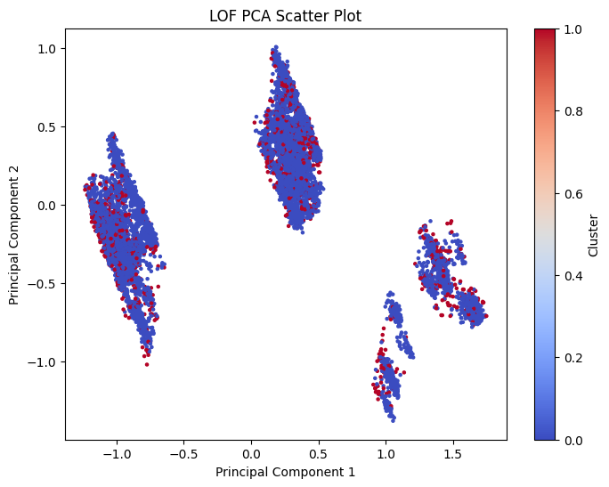

# Airline Flight Delay Project
## Problem Statement
Flight delays are a persistent and significant issue in the aviation industry, affecting millions of passengers annually. For travelers, delays lead to inconvenience, missed connections, and disrupted plans, while for airlines, they result in financial losses, operational inefficiencies, and reputational damage. The ability to predict flight delays accurately is crucial, as it enables airlines to optimize scheduling, allocate resources more effectively, and proactively communicate with passengers to minimize inconvenience.

Despite the availability of extensive flight data, predicting delays remains challenging due to the complex interplay of factors such as weather conditions, air traffic congestion, and operational constraints. This project aims to address these challenges by performing multiple data mining task in order to develop a predicitive model that classifies flights as 'on-time' or 'delayed'.

## Dataset Selection
The dataset chosen is 2019 Airline Delays w/Weather and Airport Detail, sourced from Kaggle:

https://www.kaggle.com/datasets/threnjen/2019-airline-delays-and-cancellations/data

The dataset has almost 6.5 million rows. For better running times, we sampled 10,000 rows from the dataset which will be worked on.

## Exploratory Data Analysis (EDA)
Data columns (total 26 columns):
| # | Column                        | Non-Null Count  |Dtype   |  
|---| ------                        | --------------  |-----   |  
| 0 |  MONTH                        |  10000 non-null | int64  | 
| 1 |  DAY_OF_WEEK                  |  10000 non-null | int64  | 
| 2 |  DEP_DEL15                    |  10000 non-null | int64  | 
| 3 |  DEP_TIME_BLK                 |  10000 non-null | object | 
| 4 |  DISTANCE_GROUP               |  10000 non-null | int64  | 
| 5 |  SEGMENT_NUMBER               |  10000 non-null | int64  | 
| 6 |  CONCURRENT_FLIGHTS           |  10000 non-null | int64  | 
| 7 |  NUMBER_OF_SEATS              |  10000 non-null | int64  | 
| 8 |  CARRIER_NAME                 |  10000 non-null | object | 
| 9 |  AIRPORT_FLIGHTS_MONTH        |  10000 non-null | int64  | 
| 10|  AIRLINE_FLIGHTS_MONTH        |  10000 non-null | int64  | 
| 11|  AIRLINE_AIRPORT_FLIGHTS_MONTH|  10000 non-null | int64  | 
| 12|  AVG_MONTHLY_PASS_AIRPORT     |  10000 non-null | int64  | 
| 13|  AVG_MONTHLY_PASS_AIRLINE     |  10000 non-null | int64  | 
| 14|  FLT_ATTENDANTS_PER_PASS      |  10000 non-null | float64|
| 15|  GROUND_SERV_PER_PASS         |  10000 non-null | float64|
| 16|  PLANE_AGE                    |  10000 non-null | int64  | 
| 17|  DEPARTING_AIRPORT            |  10000 non-null | object |
| 18|  LATITUDE                     |  10000 non-null | float64|
| 19|  LONGITUDE                    |  10000 non-null | float64|
| 20|  PREVIOUS_AIRPORT             |  10000 non-null | object |
| 21|  PRCP                         |  10000 non-null | float64|
| 22|  SNOW                         |  10000 non-null | float64|
| 23|  SNWD                         |  10000 non-null | float64|
| 24|  TMAX                         |  10000 non-null | float64|
| 25|  AWND                         |  10000 non-null | float64|

### Here are some statistics of these featues

<table border="1" class="dataframe">
  <thead>
    <tr style="text-align: right;">
      <th></th>
      <th>MONTH</th>
      <th>DAY_OF_WEEK</th>
      <th>DEP_DEL15</th>
      <th>DEP_TIME_BLK</th>
      <th>DISTANCE_GROUP</th>
      <th>SEGMENT_NUMBER</th>
      <th>CONCURRENT_FLIGHTS</th>
      <th>NUMBER_OF_SEATS</th>
      <th>CARRIER_NAME</th>
      <th>AIRPORT_FLIGHTS_MONTH</th>
      <th>...</th>
      <th>PLANE_AGE</th>
      <th>DEPARTING_AIRPORT</th>
      <th>LATITUDE</th>
      <th>LONGITUDE</th>
      <th>PREVIOUS_AIRPORT</th>
      <th>PRCP</th>
      <th>SNOW</th>
      <th>SNWD</th>
      <th>TMAX</th>
      <th>AWND</th>
    </tr>
  </thead>
  <tbody>
    <tr>
      <th>count</th>
      <td>10000.000000</td>
      <td>10000.000000</td>
      <td>10000.000000</td>
      <td>10000.000000</td>
      <td>10000.000000</td>
      <td>10000.000000</td>
      <td>10000.000000</td>
      <td>10000.000000</td>
      <td>10000.000000</td>
      <td>10000.000000</td>
      <td>...</td>
      <td>10000.000000</td>
      <td>10000.000000</td>
      <td>10000.000000</td>
      <td>10000.000000</td>
      <td>10000.000000</td>
      <td>10000.000000</td>
      <td>10000.000000</td>
      <td>10000.000000</td>
      <td>10000.000000</td>
      <td>10000.000000</td>
    </tr>
    <tr>
      <th>mean</th>
      <td>6.634800</td>
      <td>3.927900</td>
      <td>0.193400</td>
      <td>8.231900</td>
      <td>3.843400</td>
      <td>3.049100</td>
      <td>27.765400</td>
      <td>133.974900</td>
      <td>9.111100</td>
      <td>12640.642100</td>
      <td>...</td>
      <td>11.552000</td>
      <td>42.881500</td>
      <td>36.728235</td>
      <td>-94.237052</td>
      <td>154.376000</td>
      <td>0.106784</td>
      <td>0.028970</td>
      <td>0.101060</td>
      <td>71.490100</td>
      <td>8.306849</td>
    </tr>
    <tr>
      <th>std</th>
      <td>3.413385</td>
      <td>1.989296</td>
      <td>0.394984</td>
      <td>4.898584</td>
      <td>2.381353</td>
      <td>1.759318</td>
      <td>21.403191</td>
      <td>46.559062</td>
      <td>5.129248</td>
      <td>8810.857618</td>
      <td>...</td>
      <td>6.927185</td>
      <td>27.093569</td>
      <td>5.552612</td>
      <td>17.871948</td>
      <td>72.541372</td>
      <td>0.343852</td>
      <td>0.307371</td>
      <td>0.779256</td>
      <td>18.198885</td>
      <td>3.605541</td>
    </tr>
    <tr>
      <th>min</th>
      <td>1.000000</td>
      <td>1.000000</td>
      <td>0.000000</td>
      <td>0.000000</td>
      <td>1.000000</td>
      <td>1.000000</td>
      <td>1.000000</td>
      <td>44.000000</td>
      <td>0.000000</td>
      <td>1100.000000</td>
      <td>...</td>
      <td>0.000000</td>
      <td>0.000000</td>
      <td>19.739000</td>
      <td>-159.346000</td>
      <td>0.000000</td>
      <td>0.000000</td>
      <td>0.000000</td>
      <td>0.000000</td>
      <td>-10.000000</td>
      <td>0.450000</td>
    </tr>
    <tr>
      <th>25%</th>
      <td>4.000000</td>
      <td>2.000000</td>
      <td>0.000000</td>
      <td>4.000000</td>
      <td>2.000000</td>
      <td>2.000000</td>
      <td>11.000000</td>
      <td>90.000000</td>
      <td>5.000000</td>
      <td>5337.000000</td>
      <td>...</td>
      <td>5.000000</td>
      <td>17.000000</td>
      <td>33.436000</td>
      <td>-106.377000</td>
      <td>99.000000</td>
      <td>0.000000</td>
      <td>0.000000</td>
      <td>0.000000</td>
      <td>59.000000</td>
      <td>5.820000</td>
    </tr>
    <tr>
      <th>50%</th>
      <td>7.000000</td>
      <td>4.000000</td>
      <td>0.000000</td>
      <td>8.000000</td>
      <td>3.000000</td>
      <td>3.000000</td>
      <td>23.000000</td>
      <td>143.000000</td>
      <td>10.000000</td>
      <td>11588.000000</td>
      <td>...</td>
      <td>12.000000</td>
      <td>42.000000</td>
      <td>37.363000</td>
      <td>-87.906000</td>
      <td>182.000000</td>
      <td>0.000000</td>
      <td>0.000000</td>
      <td>0.000000</td>
      <td>74.000000</td>
      <td>7.830000</td>
    </tr>
    <tr>
      <th>75%</th>
      <td>10.000000</td>
      <td>6.000000</td>
      <td>0.000000</td>
      <td>12.000000</td>
      <td>5.000000</td>
      <td>4.000000</td>
      <td>39.000000</td>
      <td>172.000000</td>
      <td>14.000000</td>
      <td>17522.000000</td>
      <td>...</td>
      <td>17.000000</td>
      <td>66.000000</td>
      <td>40.779000</td>
      <td>-80.936000</td>
      <td>203.000000</td>
      <td>0.030000</td>
      <td>0.000000</td>
      <td>0.000000</td>
      <td>86.000000</td>
      <td>10.290000</td>
    </tr>
    <tr>
      <th>max</th>
      <td>12.000000</td>
      <td>7.000000</td>
      <td>1.000000</td>
      <td>18.000000</td>
      <td>11.000000</td>
      <td>13.000000</td>
      <td>108.000000</td>
      <td>337.000000</td>
      <td>16.000000</td>
      <td>35256.000000</td>
      <td>...</td>
      <td>32.000000</td>
      <td>94.000000</td>
      <td>61.169000</td>
      <td>-70.304000</td>
      <td>291.000000</td>
      <td>11.630000</td>
      <td>9.900000</td>
      <td>18.900000</td>
      <td>115.000000</td>
      <td>33.780000</td>
    </tr>
  </tbody>
</table>

### Correlation Heatmap Between All Features

### Correlation Between Delayed Flights and Features

### Data Proportions

### Ontime Flights vs Delayed Flights

### Departing Airports Delays
Here is a map of the departing airports in the dataset with the noted frequency of flights being delayed

The top 5 airports with the most delays are:
|DEPARTING_AIRPORT                 | Flight Delays    |
|----------------------------------|------------------|
|Atlanta Municipal                 | 109              |
|Stapleton International           | 108              |
|Chicago O'Hare International      | 97               |
|Dallas Fort Worth Regional        | 96               |
|Douglas Municipal                 | 74               |

### TO DO 
- Discuss key insights drawn from EDA and potential challenges with the
dataset (e.g., class imbalance, highly correlated features).

## Data Preprocessing
Our dataset did not include any missing values, so we did not need to perform any data imputation or removal. For the categorical variables we opted to use label encoding over one-hot encoding because the features DEPARTING_AIRPORT and PREVIOUS_AIRPORT contained many unique values. This was not ideal as it created hundreds of additional columns, due to how one-hot coding creates a separate column for each category.

Once our categorical variables were transformed into numerical features, we performed both normalization and standardization separately to test which one performed better during classification. As for the clustering task, we only utilized the normalized data. Data augmnetation was not applicable to our dataset and dimensionality techniques such as PCA or t-SNE were mainly used in visualizing scatter plots, as dimensionality reduction did not make much of a difference when used in classification. 

## Clustering
The two clustering algorithms that we decided to apply on our dataset was K-Means and Hierarchical Clustering, specifically Agglomerative Clustering.

### K-Means
- How we decided on the parameter k?

### Agglomerative Clustering
- How we decided on the parameter k?

### Evaluating Clustering Performance

<table border="1" class="dataframe">
  <thead>
    <tr style="text-align: right;">
      <th></th>
      <th>K</th>
      <th>Algorithm</th>
      <th>Silhouette Score</th>
      <th>Calinski-Harabasz Index</th>
      <th>Davies-Bouldin Index</th>
    </tr>
  </thead>
  <tbody>
    <tr>
      <th>0</th>
      <td>3</td>
      <td>K-Means</td>
      <td>0.176457</td>
      <td>1735.869896</td>
      <td>1.920981</td>
    </tr>
    <tr>
      <th>1</th>
      <td>3</td>
      <td>Agglomerative</td>
      <td>0.164257</td>
      <td>1607.696503</td>
      <td>1.935787</td>
    </tr>
  </tbody>
</table>

### TO DO
- Discuss the appropriateness of the clustering algorithms for your dataset and
compare their performances.

## Outlier Detection
The two outlier detection methods we used on our dataset was Isolation Forest and Local Outlier Factor (LOF).

### TO DO
- Deciding on the contamination parameter. 

### Isolation Forest

### Local Outlier Factor

### TO DO
- Show the differences between classification scores with dataframe with outliers and without outliers.

- Analyze the outliers: Are they noise, or do they contain important
information? Decide whether to keep or remove them for further analysis.

## Feature Selection
The feature selection technique we utilized was Recursive Feature Elimination (RFE).

### Importance of Selected Features and Impact on the Classification Task
- Discuss the importance of selected features and their impact on the
classification task.

### Evaluating Feature Selection Performance
- Evaluate the model with and without feature selection to compare performance
and computational efficiency.

## Classification 
The classification algorithms we utilized includes ...

### Evaluating Performance

## Hyperparameter Tuning
The classifier we performed hyperparamter tuning on is ... using Grid Search.

### Evaluating Performance
- Compare the performance of the model before and after tuning. Discuss the
impact of tuning on model performance.

## Conclusion

### TO DO
- Discuss the insights that you learned about the domain of the dataset
(e.g., for a rental dataset it could be people’s preference and general taste
for renting).

### Insights
Working with the flight delay dataset, we have learned that classifying flight delays into 'on-time' and 'delayed' categories is more complex than initially expected. ...

### Data Mining Methodology Lessons
This project reinforced several core steps in data mining methodology. First, the importance of data preprocessing became clear, as transforming numerical features and catergorical variables into a format suitable for analysis was crucial for obtaining meaningful results. Additionally, the effectiveness of clustering algorithms in uncovering hidden patterns was evident, demonstrating the value of unsupervised learning methods in exploratory data analysis. Finally, the need for careful evaluation of model performance was highlighted, as simple classification models often failed to capture the complexity of our dataset, urging the use of more sophisticated such as feature selection techniques and hyperparameter tuning.

### Challenges, Limitations, and Future Work
While the results from clustering and classification models were insightful, serveral challenges and limitations were encountered throughout the course of the project.

### TO DO
- The README file in your repository will serve as the primary report. It
should clearly explain the results of each task, with references to the relevant
sections of the code.

