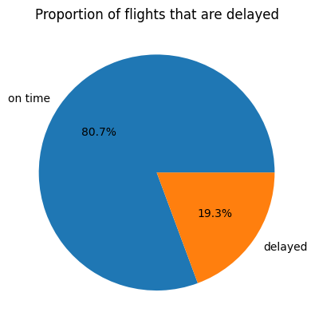

# Airline Flight Delay Project
Dataset:

https://www.kaggle.com/datasets/threnjen/2019-airline-delays-and-cancellations/data

The dataset has almost 6.5 million rows. For better running times, I sampled 10,000 rows from the dataset which will be worked on

## Data Exploration

The dataset contains 26 columns

Index: 10000 entries, 1866883 to 4201534
Data columns (total 26 columns):
| # | Column                        | Non-Null Count  |Dtype   |  
|---| ------                        | --------------  |-----   |  
| 0 |  MONTH                        |  10000 non-null | int64  | 
| 1 |  DAY_OF_WEEK                  |  10000 non-null | int64  | 
| 2 |  DEP_DEL15                    |  10000 non-null | int64  | 
| 3 |  DEP_TIME_BLK                 |  10000 non-null | object | 
| 4 |  DISTANCE_GROUP               |  10000 non-null | int64  | 
| 5 |  SEGMENT_NUMBER               |  10000 non-null | int64  | 
| 6 |  CONCURRENT_FLIGHTS           |  10000 non-null | int64  | 
| 7 |  NUMBER_OF_SEATS              |  10000 non-null | int64  | 
| 8 |  CARRIER_NAME                 |  10000 non-null | object | 
| 9 |  AIRPORT_FLIGHTS_MONTH        |  10000 non-null | int64  | 
| 10|  AIRLINE_FLIGHTS_MONTH        |  10000 non-null | int64  | 
| 11|  AIRLINE_AIRPORT_FLIGHTS_MONTH|  10000 non-null | int64  | 
| 12|  AVG_MONTHLY_PASS_AIRPORT     |  10000 non-null | int64  | 
| 13|  AVG_MONTHLY_PASS_AIRLINE     |  10000 non-null | int64  | 
| 14|  FLT_ATTENDANTS_PER_PASS      |  10000 non-null | float64|
| 15|  GROUND_SERV_PER_PASS         |  10000 non-null | float64|
| 16|  PLANE_AGE                    |  10000 non-null | int64  | 
| 17|  DEPARTING_AIRPORT            |  10000 non-null | object |
| 18|  LATITUDE                     |  10000 non-null | float64|
| 19|  LONGITUDE                    |  10000 non-null | float64|
| 20|  PREVIOUS_AIRPORT             |  10000 non-null | object |
| 21|  PRCP                         |  10000 non-null | float64|
| 22|  SNOW                         |  10000 non-null | float64|
| 23|  SNWD                         |  10000 non-null | float64|
| 24|  TMAX                         |  10000 non-null | float64|
| 25|  AWND                         |  10000 non-null | float64|
dtypes: float64(9), int64(13), object(4)
memory usage: 2.1+ MB

