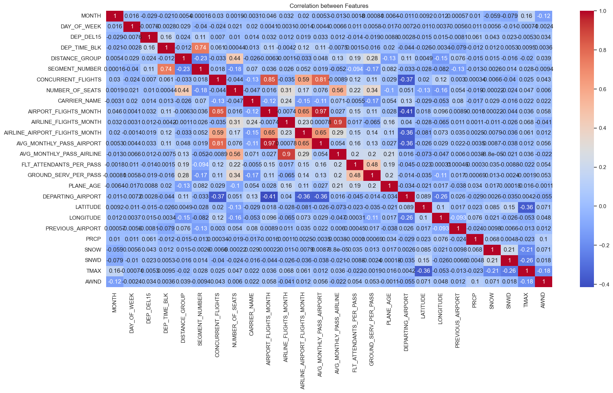
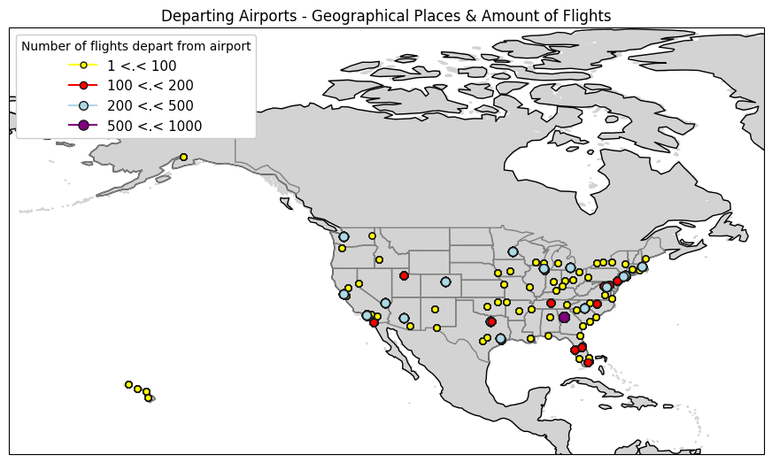
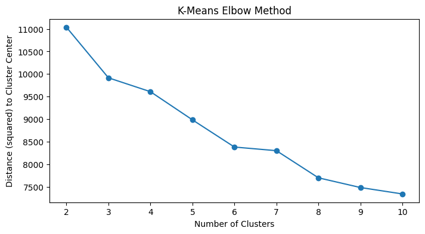
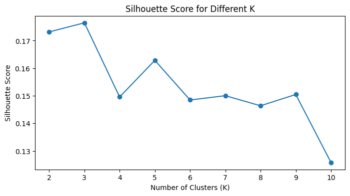
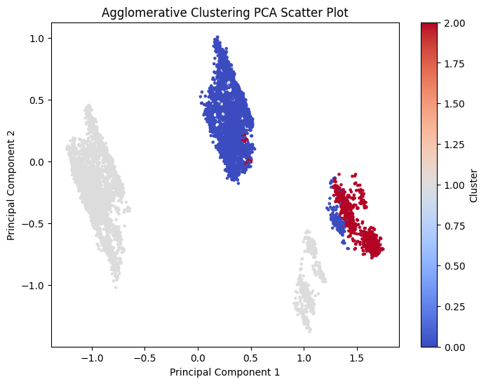
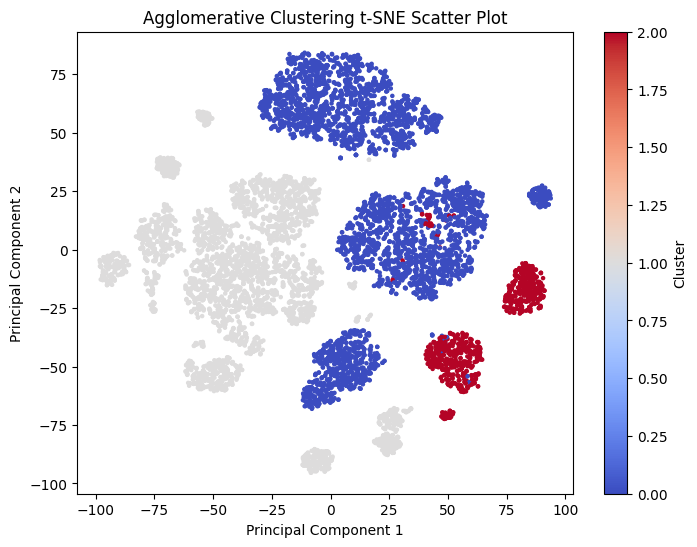
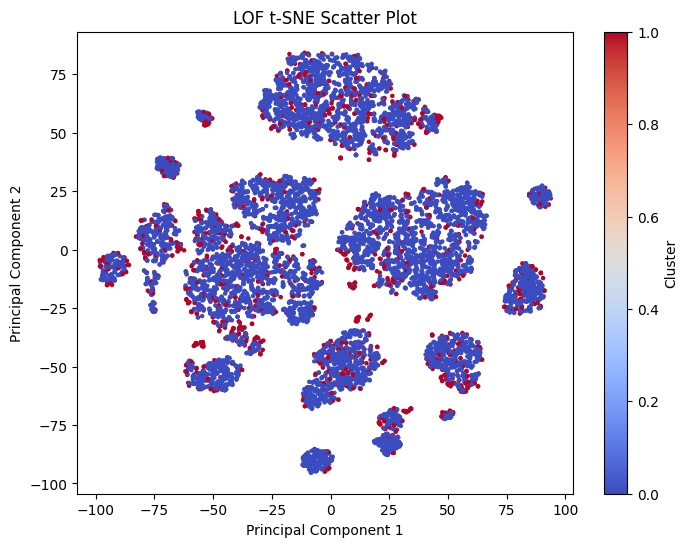

# Airline Flight Delay Project
## Problem Statement
Flight delays are a persistent and significant issue in the aviation industry, affecting millions of passengers annually. For travelers, delays lead to inconvenience, missed connections, and disrupted plans, while for airlines, they result in financial losses, operational inefficiencies, and reputational damage. The ability to predict flight delays accurately is crucial, as it enables airlines to optimize scheduling, allocate resources more effectively, and proactively communicate with passengers to minimize inconvenience.

Despite the availability of extensive flight data, predicting delays remains challenging due to the complex interplay of factors such as weather conditions, air traffic congestion, and operational constraints. This project aims to address these challenges by performing multiple data mining task in order to develop a predicitive model that classifies flights as 'on-time' or 'delayed'.

## Dataset Selection
The dataset chosen is 2019 Airline Delays w/Weather and Airport Detail, sourced from Kaggle:

https://www.kaggle.com/datasets/threnjen/2019-airline-delays-and-cancellations/data

The dataset has almost 6.5 million rows. For better running times, we sampled 10,000 rows from the dataset which will be worked on.

## Exploratory Data Analysis (EDA)
Data columns (total 26 columns):
| # | Column                        | Non-Null Count  |Dtype   |  
|---| ------                        | --------------  |-----   |  
| 0 |  MONTH                        |  10000 non-null | int64  | 
| 1 |  DAY_OF_WEEK                  |  10000 non-null | int64  | 
| 2 |  DEP_DEL15                    |  10000 non-null | int64  | 
| 3 |  DEP_TIME_BLK                 |  10000 non-null | object | 
| 4 |  DISTANCE_GROUP               |  10000 non-null | int64  | 
| 5 |  SEGMENT_NUMBER               |  10000 non-null | int64  | 
| 6 |  CONCURRENT_FLIGHTS           |  10000 non-null | int64  | 
| 7 |  NUMBER_OF_SEATS              |  10000 non-null | int64  | 
| 8 |  CARRIER_NAME                 |  10000 non-null | object | 
| 9 |  AIRPORT_FLIGHTS_MONTH        |  10000 non-null | int64  | 
| 10|  AIRLINE_FLIGHTS_MONTH        |  10000 non-null | int64  | 
| 11|  AIRLINE_AIRPORT_FLIGHTS_MONTH|  10000 non-null | int64  | 
| 12|  AVG_MONTHLY_PASS_AIRPORT     |  10000 non-null | int64  | 
| 13|  AVG_MONTHLY_PASS_AIRLINE     |  10000 non-null | int64  | 
| 14|  FLT_ATTENDANTS_PER_PASS      |  10000 non-null | float64|
| 15|  GROUND_SERV_PER_PASS         |  10000 non-null | float64|
| 16|  PLANE_AGE                    |  10000 non-null | int64  | 
| 17|  DEPARTING_AIRPORT            |  10000 non-null | object |
| 18|  LATITUDE                     |  10000 non-null | float64|
| 19|  LONGITUDE                    |  10000 non-null | float64|
| 20|  PREVIOUS_AIRPORT             |  10000 non-null | object |
| 21|  PRCP                         |  10000 non-null | float64|
| 22|  SNOW                         |  10000 non-null | float64|
| 23|  SNWD                         |  10000 non-null | float64|
| 24|  TMAX                         |  10000 non-null | float64|
| 25|  AWND                         |  10000 non-null | float64|

### Correlation Heatmap Between All Features

- AIRPORT_FLIGHTS_MONTH and AVG_MONTHLY_PASS_AIRPORT have the strongest correlation with a value of 0.97, this might indicate redundancy as these features may capture overlapping information about flight frequency.
- Features like AVG_MONTHLY_PASS_AIRLINE and AVG_MONTHLY_PASS_AIRPORT show moderate correlation with flight-related variables. This suggests a meaningful relationship between the number of passengers and flight frequency or availability.
- Weather features such as PRCP, SNOW, TMAX, and AWNND show weak correlations with most other features, this might indicate that weather-related factors may play a smaller role in the dataset, or the impact of weather on delay may not be fully captured.
### Correlation Between Delayed Flights and Features


The two strongest positive correlations between delayed flights and features are DEP_TIME_BLK and SEGMENT_NUMBER. Both these features are temporal aspects as DEP_TIME_BLK represents the distance group to be flown by departing aircraft and SEGMENT_NUMBER represents the segment that this tail number is on for the day. This might indicate that the time of departure is a key factor affecting delays. For instance, certain time blocks might experience higher congestion and delays.
### Data Proportions


The pie chart shows that 80.7% of the data is 'on-time' and only 19.3% is 'delayed' this clearly shows a skewed distribution. This indicates that the dataset is imbalanced, which can present challenges for classification models. Models trained on this dataset may become biased toward predicting the majority class ('on-time') because it dominates the training data. This can result in high accuracy but poor recall for the minority class ('delayed') and also misleading metrics like accuracy. 
### Ontime Flights vs Delayed Flights

### Departing Airports Delays
Here is a map of the departing airports in the dataset with the noted frequency of flights being delayed

The top 5 airports with the most delays are:
|DEPARTING_AIRPORT                 | Flight Delays    |
|----------------------------------|------------------|
|Atlanta Municipal                 | 109              |
|Stapleton International           | 108              |
|Chicago O'Hare International      | 97               |
|Dallas Fort Worth Regional        | 96               |
|Douglas Municipal                 | 74               |

## Data Preprocessing
Our dataset did not include any missing values, so we did not need to perform any data imputation or removal. For the categorical variables we opted to use label encoding over one-hot encoding because the features DEPARTING_AIRPORT and PREVIOUS_AIRPORT contained many unique values. This was not ideal as it created hundreds of additional columns, due to how one-hot coding creates a separate column for each category.

Once our categorical variables were transformed into numerical features, we performed both normalization and standardization separately to test which one performed better during classification. As for the clustering task, we only utilized the normalized data. Data augmnetation was not applicable to our dataset and dimensionality techniques such as PCA or t-SNE were mainly used in visualizing scatter plots, as dimensionality reduction did not make much of a difference when used in classification. 

**Relevant Section of Code: main_classifiers.ipynb**

## Clustering
The two clustering algorithms that we decided to apply on our dataset was K-Means and Hierarchical Clustering, specifically Agglomerative Clustering.

### K-Means
Deciding on the best parameter k we first fit K-Means for a range of values from 2 to 10. In each fit we appended the inertia and silhouette score for each value of k to their respective list. We then plotted the values on a plot to compare each value of k. 

Inertia is the sum of squared distances between each data point and the centroid of its assigned cluster. It measures how tightly the data points are grouped within each cluster. Lower inertia indicates that points are closer to their cluster centers. Analyzing the inertia values on the plot we can use the elbow method, which looks for the "elbow point" in the curve. This is where the rate of decrease in inertia slows significantly. Before the elbow, adding clusters reduces inertia significantly because clusters better fit the data. While adding clusters after the elbow provides diminishing returns, as clusters become overly specific or redundant. This is why selecting the "elbow point" makes a good parameter for k as it balances good clustering performance with model simplicity. From the plot "K-Means Elbow Method" we can see that the elbow method suggests the "elbow" point for this data appears at k=3, because the largest decrease occurs between k=2 and k=3. 

To confirm the value of k, we used the silhouette score to evaluate the quality of clustering, as it measures how similar each data point is to its own cluster compared to other clusters. A higher silhouette score indicates better defined clusters, so looking at the plot "Silhouette Score for Different K" we can choose where the score peaks, as it represents the best separation of clusters. The peak is indicated at k=3 as well, confirming our value of k.




### Agglomerative Clustering
For Agglomerative Clustering we plotted the dendrogram to decide on an appropriate value of k. The dendrogram suggest that k=3, because there are three large vertical gaps in the upper levels of the tree, the blue line at the top shows the largest merges, and splits off into three main groups. 




### Evaluating Clustering Performance

<div>
<table border="1" class="dataframe">
  <thead>
    <tr style="text-align: right;">
      <th></th>
      <th>K</th>
      <th>Algorithm</th>
      <th>Silhouette Score</th>
      <th>Calinski-Harabasz Index</th>
      <th>Davies-Bouldin Index</th>
    </tr>
  </thead>
  <tbody>
    <tr>
      <th>0</th>
      <td>3</td>
      <td>K-Means</td>
      <td>0.176457</td>
      <td>1735.869896</td>
      <td>1.920981</td>
    </tr>
    <tr>
      <th>1</th>
      <td>3</td>
      <td>Agglomerative</td>
      <td>0.164257</td>
      <td>1607.696503</td>
      <td>1.935787</td>
    </tr>
  </tbody>
</table>
</div>

Comparing the two clustering algorithms performance we can see that K-Means has a better performance across all three metrics, making it the preferred algorithm for this dataset. The Calinski-Harabasz Index is relatively higher than Agglomerative clustering, indicating better defined cluster separation and compactness, while the Davies-Bouldin Index is slightly lower suggesting that K-Means produced more distinct and compact clusters. However, both clustering algorithms show relatively low silhouette scores, which might indicate that the dataset does not have well-defined cluster boundaries or that there may be a better value for k. For future tests, experimenting with other algorithms such as DBSCAN or Gaussian Mixture Models (GMM) may capture more complex cluster shapes or densities. Additionally, testing different linkage methods for Agglomerative Clustering may improve results.

**Relevant Section of Code: main_clusters.ipynb**

## Outlier Detection
The two outlier detection methods we used on our dataset was Isolation Forest and Local Outlier Factor (LOF). Outlier methods require a parameter called contamination, this parameter specifies the proportion of the dataset that is expected to be outliers. It essentially informs the algorithm about how many data points should be flagged as anomalies. To obtain an approximation of the fraction of anomalous data points in the dataset the estimate for contamination is calculated by dividing the total number of outliers by the total number of samples. The number of outliers was obtained by calculating the absolute value for z-score and marking any data point that was greater than 3 as an anomalous data point. This gave us a estimated contamination value of 0.13.

### Isolation Forest


### Local Outlier Factor





After performing classification algorithms on the dataset with outliers and without outliers we found that the results from keeping the outliers in the dataset had better performance (Refer to classification section for results). From this information we can consider that the outliers contain information and keep them for further analysis.

**Relevant Section of Code: main_clusters.ipynb**
- Contains code for outlier plots

**Relevant Section of Code: main_classifiers.ipynb**
- Contains code for classification comparison

## Feature Selection
The feature selection technique we employed was Recursive Feature Elimination (RFE). During our analysis, we observed that the algorithm selected a varying number of features across different runs. However, when averaged over five runs, five features consistently appeared as the most frequently selected. Some of these features, such as the average monthly passenger count at the airport and the airline, were reasonably excluded due to their low correlation with other features. Additionally, the snow feature was likely removed because of its low occurrence in the dataset; snowfall is rare for most of the year, which likely led RFE to deem it less significant for the model. We ran the model with the removed features and the results are shown in the classification section of this report. 

|Removable Features by Frequency|
|-------------------------------|
|FLT_ATTENDANTS_PER_PASS|
|SNOW|
|SNWD|
|AVG_MONTHLY_PASS_AIRPORT|
|AVG_MONTHLY_PASS_AIRLINE|

**Relevant Section of Code: main_classifiers.ipynb**
- Contains code for run_rfe function


## Classification 
 
Our team of two tested four classification models—Random Forests, KNN, SVM, and LightGBM—and evaluated their performance. To ensure a comprehensive analysis, we first ran the models with outliers included, then re-ran them after applying two different outlier detection methods. We evaluated these models using accuracy scores, cross-validation, f-1 scores and ROC curves. Based on this evaluation, we selected the best-performing model for hyperparameter tuning to further optimize its performance. 

### Evaluating Performance
Here are the results of our models. 

Weighted
-------------------------------------------------------------------------
|Classification Model| Accuracy Score| Cross Validation| Ontime Precision |Ontime Recall |Delayed Precision | Delayed Recall |  F-1 Score| AUC Score |  
|--------------------|---------------|-----------------|----------------|----------------|------------------|----------------|-----------|-----------|
| Random Forest (Standard Scaler)| 0.795| 0.792| 0.8| 0.99| 0.32| 0.01| 0.79| 0.503|
| KNN    (Standard Scaler)   | 0.7815|0.767  | 0.81| 0.95| 0.38| 0.13| 0.78| 0.538| 
| SVM    (Standard Scaler)   | 0.6325|0.61  | 0.85| 0.65| 0.29| 0.57| 0.63| 0.607| 
| LightGBM    (Standard Scaler) | 0.6705|0.7025  |0.86| 0.70| 0.32| 0.57| 0.67| 0.631|
| Random Forest (Min Max Scaler)|0.7975 |0.795 | 0.80| 0.99| 0.43| 0.02| 0.80| 0.507|
| KNN    (Min Max Scaler)   | 0.77| 0.767| 0.81| 0.94| 0.32| 0.12| 0.77| 0.526|
| SVM    (Min Max Scaler)   | 0.606| 0.578| 0.86| 0.60| 0.28| 0.62| 0.61| 0.610|
| LightGBM    (Min Max Scaler) | 0.6685| 0.6905| 0.86| 0.69| 0.32| 0.57| 0.67| 0.630|
### ROC Plot


### Confusion Matrices


### Impact of Scaling Methods. 
Standard Scaler and Min-Max scaler produced similar patterns across most models, with slight variations in performance. For the Random Forest models, both scalers yielded high on-time recall (0.99), but delayed recall was extremely low (0.01-0.02), suggesting that the model struggles with the minority class regardless of scaling. For LightGBM, the AUC scores were slightly higher with the Standard Scaler (0.631 vs 0.630), indicating marginally better class separation.

### Performance on Delayed Flights
LightGBM consistently achieved the highest balance between delayed precision (0.32) and recall (0.57) under both scaling methods, resulting in higher AUC scores (0.631 and 0.630). This highlights its potential for minority class prediction. 

KNN achieved slightly better delayed precision (0.38 with Standard Scaler), but its recall (0.13) was low, limiting its utility for detecting delayed flights.

SVM showed notable improvement in delayed recall compared to other models, especially under Standard Scaler (0.57). However, its lower overall accuracy (0.6325) suggests a trade-off in general performance. 

### On-Time Flight Predictions (Majority Class):

All models performed well for on-time flight predictions, with precision ranging from 0.80 to 0.86 and recall from 0.94 to 0.99.

SVM and LightGBM demonstrated the highest on-time precision (0.86), reflecting their ability to avoid false positives for on-time flights.

### Overall Model Performance:

Random Forest consistently achieved the highest accuracy (0.795–0.7975), driven largely by its dominance in the majority class. However, its poor performance for delayed flights (AUC scores ~0.5) limits its practicality in this dataset.

KNN offered balanced accuracy (0.77–0.7815) and cross-validation scores (0.767) but struggled with delayed recall, suggesting room for improvement in handling minority classes.

SVM achieved lower accuracy than the previous 2 models (0.606-0.6325), but showed potential for delayed flight detection with relatively high recall (0.57) and decent AUC scores (0.607–0.610).

LightGBM, despite lower accuracy (0.6685–0.6705), demonstrated better AUC scores (0.630–0.631), highlighting its ability to balance performance across both classes. This makes it a strong candidate for scenarios prioritizing minority class predictions.


Weighted ISO
------------------------------------------------------------------------------------------
|Classification Model| Accuracy Score| Cross Validation| Ontime Precision |Ontime Recall |Delayed Precision | Delayed Recall |  F-1 Score| AUC Score |  
|--------------------|---------------|-----------------|----------------|----------------|------------------|----------------|-----------|-----------|
| Random Forest (Standard Scaler)| 0.832| 0.830| 0.83| 1.0| 0.4| 0.01| 0.83| 0.505|
| KNN    (Standard Scaler)   | 0.809| 0.813| 0.84| 0.95| 0.27| 0.08| 0.81| 0.518|
| SVM    (Standard Scaler)   | 0.643| 0.671| 0.89| 0.66| 0.25| 0.58| 0.64| 0.619|
| LightGBM    (Standard Scaler) | 0.67| 0.736| 0.88| 0.71| 0.26| 0.50| 0.67| 0.604|
| Random Forest (Min Max Scaler)| 0.8304| 0.83| 0.83|1.0| 0.25| 0.01| 0.83| 0.501|
| KNN    (Min Max Scaler)   | 0.81| 0.814| 0.84| 0.96| 0.29| 0.09| 0.81| 0.522|
| SVM    (Min Max Scaler)   | 0.602| 0.626| 0.89| 0.60| 0.24| 0.63| 0.60| 0.612|
| LightGBM    (Min Max Scaler) | 0.671| 0.743| 0.88| 0.70| 0.26| 0.51| 0.67| 0.606|
### ROC Plot


### Confusion Matrices


Weighted LOF
---------------------------------------------------------------------------
|Classification Model| Accuracy Score| Cross Validation| Ontime Precision |Ontime Recall |Delayed Precision | Delayed Recall |  F-1 Score| AUC Score |  
|--------------------|---------------|-----------------|----------------|----------------|------------------|----------------|-----------|-----------|
| Random Forest (Standard Scaler)| 0.830| 0.832| 0.83| 1.0| 0.25| 0.01| 0.83| 0.501|
| KNN    (Standard Scaler)   | 0.808| 0.813| 0.84| 0.95| 0.27| 0.08| 0.81| 0.518|
| SVM    (Standard Scaler)   | 0.644| 0.671| 0.89| 0.66| 0.25| 0.58| 0.64| 0.618|
| LightGBM    (Standard Scaler) | 0.672| 0.736| 0.88| 0.71| 0.26| 0.50| 0.67| 0.604|
| Random Forest (Min Max Scaler)| 0.831| 0.832| 0.83| 1.0| 0.38| 0.01| 0.83| 0.503|
| KNN    (Min Max Scaler)   | 0.810| 0.814| 0.84| 0.96| 0.29| 0.09| 0.81| 0.522|
| SVM    (Min Max Scaler)   | 0.603| 0.626| 0.89| 0.60| 0.24| 0.63| 0.60| 0.612|
| LightGBM    (Min Max Scaler) | 0.671| 0.743| 0.88| 0.70| 0.26| 0.51| 0.67| 0.606|
### ROC Plot


### Confusion Matrix


### General Insights on Outlier Detection Results
The removal of outliers using the Isolation Forest and Local Outlier Factor methods generally did not improve model performance. While minor improvements were observed in cross-validation scores for some models, such as LightGBM, the overall accuracy, precision, and recall metrics remained largely unchanged. In several cases, performance for the minority class (delayed flights) actually worsened, with delayed recall decreasing for models like Random Forest. These results suggest that outlier removal in this context had a limited positive impact and may have inadvertently reduced the models' ability to generalize to the minority class.

**Relevant Section of Code: main_classifiers.ipynb**

## Evaluating Recursive Feature Selection Performance
Here are the results of the models after applying Recursive Feature Elimination. The performance of the models was analyzed across various metrics, revealing distinct strengths and weaknesses for each classification method 

Recursive Feature Selection Results
---------------------------------------------------------------------------
|Classification Model| Accuracy Score| Cross Validation| Ontime Precision |Ontime Recall |Delayed Precision | Delayed Recall |  F-1 Score| AUC Score |  
|--------------------|---------------|-----------------|----------------|----------------|------------------|----------------|-----------|-----------|
| Random Forest (Min Max Scaler)| 0.793| 0.789| 0.80| 0.99| 0.36| 0.02| 0.79| 0.507|
| KNN    (Min Max Scaler)   | 0.77| 0.761| 0.80| 0.95| 0.28| 0.08| 0.77| 0.515|
| SVM    (Min Max Scaler)   | 0.798| 0.798|0.80| 1.0| 0.0| 0.0| 0.80| 0.5|
| LightGBM    (Min Max Scaler) | 0.704| 0.729| 0.85| 0.76| 0.34| 0.48| 0.70| 0.621|
### ROC Plot


### Confusion Matrices


### Random Forest

The Random Forest model achieved high accuracy and strong recall for on-time flights, indicating it correctly identifies most on-time flights. However, its performance in predicting delayed flights was poor, with a recall of only 0.02, suggesting it rarely identifies delayed flights correctly. The low AUC score (0.507) reflects limited discrimination between the two classes.

### KNN 

KNN exhibited similar challenges to Random Forest, with good performance for on-time flights but limited success in predicting delays. The delayed recall was slightly better at 0.08, but the overall ability to capture delayed flights remains weak. The AUC score (0.515) suggests only marginal improvement in class discrimination.

### SVM

The SVM model achieved the highest recall for on-time flights, perfectly identifying all instances in this class. However, it completely failed to make predictions for delayed flights, with both precision and recall at 0. This highlights a significant limitation in the model's ability to handle class imbalance, despite its high accuracy for the majority class.

### LightGBM

LightGBM provided the most balanced performance, achieving moderate precision and recall for both on-time and delayed flights. Notably, its delayed recall (0.48) was the highest among all models, making it better suited for handling the minority class. The AUC score (0.621) further confirms its superior class separation ability compared to other models.

**Relevant Section of Code: main_classifiers.ipynb**
## Hyperparameter Tuning
The classifier we performed hyperparamter tuning on is the LGBM classifier since it showed strong results in minority class recall, while maintaining decent overall accuracy of the majority class. We used Grid Search method to find the best parameters among the following params to find the highest recall performance.
```
param_grid = {
        'num_leaves': [31, 127],
        'reg_alpha': [0.1, 0.5],
        'min_data_in_leaf': [30, 50, 100, 300, 400],
        'lambda_l1': [0, 1, 1.5],
        'lambda_l2': [0, 1],
        
    }
```


### GridSearch Parameter Selection
Shown below are the parameters that GridSearch ultimately decided to select
```
Chosen Params: {'lambda_l1': 1.5, 'lambda_l2': 1, 'min_data_in_leaf': 400, 'num_leaves': 31, 'reg_alpha': 0.1}
```

The chosen parameters (lambda_l1=1.5, lambda_l2=1, min_data_in_leaf=400, num_leaves=31, and reg_alpha=0.1) suggest that the model prioritized strong regularization and a conservative leaf structure. These settings aim to prevent overfitting by limiting tree complexity and controlling leaf size.
The smaller num_leaves value (31) keeps the model simple, while min_data_in_leaf=400 ensures that splits occur only when there is substantial data to support them, favoring generalization over precision in edge cases.


### Hyperparameter Tuning Performance
Here are the results of the hyperparameter tuning. We were specifically trying to optimize the recall performance of the LGBM model


------------------------------------------------------------------------------------------
|Classification Model| Accuracy Score| Cross Validation| Ontime Precision |Ontime Recall |Delayed Precision | Delayed Recall |  F-1 Score| AUC Score |  
|--------------------|---------------|-----------------|----------------|----------------|------------------|----------------|-----------|-----------|
| LightGBM    (Min Max Scaler) | 0.606| 0.657| 0.87| 0.64| 0.31| 0.64| 0.64| 0.637|


### Evaluating Performance
The tuned model achieved an AUC score of 0.637, indicating better class separation than earlier iterations of LightGBM, where AUC scores ranged around 0.604–0.631. This reflects the model’s improved ability to distinguish between on-time and delayed flights. The delayed recall (0.64) improved over the previous LightGBM runs while the delayed precison remained consistent, highlighting the model is now better at detecting delayed flights but still produces false positives at a pretty high rate. The ontime recall got worse (0.64), reflecting a slight tradeoff, with the model showing increased conservativeness in predicting on-time flights, reducing over-prediction of the majority class. Ultimately, the GridSearch method did improve the performance of the LightGBM model, but the low delay precision suggests that the class imbalance still poses a challenge for the model.  

**Relevant Section of Code: main_classifiers.ipynb**

## Conclusion

### Data Mining Methodology Lessons
This project reinforced several core steps in data mining methodology. First, the importance of data preprocessing became clear, as transforming numerical features and categorical  variables into a format suitable for analysis was crucial for obtaining meaningful results. Additionally, the effectiveness of clustering algorithms in uncovering hidden patterns was evident, demonstrating the value of unsupervised learning methods in exploratory data analysis. Finally, the need for careful evaluation of model performance was highlighted, as simple classification models often failed to capture the complexity of our dataset, urging the use of more sophisticated methods such as feature selection techniques and hyperparameter tuning.

### Challenges, Limitations, and Future Work
While the results from clustering and classification models were insightful, several challenges and limitations were encountered throughout the course of the project. One of the key challenges we found in our EDA was the imbalance in the dataset, with approximately 81% of the flights labeled as 'on-time' and only 19% as 'delayed'. This class imbalance introduced bias in model training, as the model may have become biased towards predicting the majority class ('ontime') more frequently, leading to a poor performance in detecting delayed flights. The complexity of flight delays, influenced by a multitude of unpredictable variables, also hindered the performance of the models. Future work on the project could involve integrating additional data sources to improve prediction accuracy or focussing on analyzing the temporal aspects of flight delays to further refine the models. Furthermore, exploring deep learning techniques or ensemble methods could potentially yield better results for predicting delays.

### Final Insights
Working with the flight delay dataset, we have learned that classifying flight delays into 'on-time' and 'delayed' categories is more complex than initially expected. Despite using a variety of classification models, hyperparameter tuning and outlier detection techniques, we were unable to achieve a model capable of reliably identifying delayed flights with high accuracy or precision. This outcome underscores two significant challenges: the class imbalance in the dataset, where on-time flights vastly outnumber delays, and the general unpredictable nature of flight delays, which are influenced by external factors such as weather, air traffic, and operational disruptions. Overall we enjoyed working on this project, especially designing the graphs and figures that best describe the behaviour of the data. This was an interesting project that allowed use to apply what we learned in class to a real-life dataset, and even though model performances were not ideal, it was a great learning experience. 


